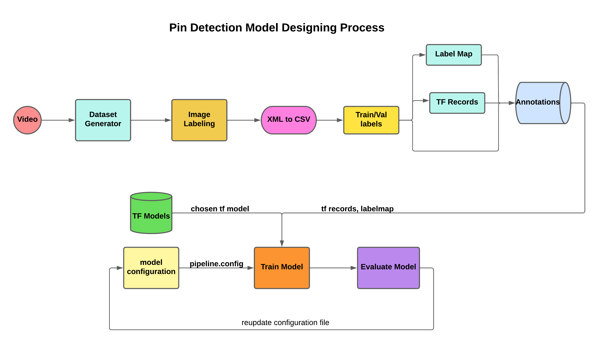

# Pin Detection Model 

### (Fine Tuning ssd_resnet50_v1_fpn_640x640_coco17 Model)

Note : The dataset and the pretrained models (images, my_models) folders used in this repo have been deleted !!

- ## annotations: 
    - it includes all required files by the model during training process
  - **train_label, val_label**: Those csv files include all information about the pin positions, type of the pin, width and height of the image.
  - **train,val record**:  those 2 files include the tf records of training and validation dataset.
  - **labelmap**: this file includes all information about each type of pins , and since we have only one, so it includes only one item.
- ## images :
    - Train and validation dataset images of different pin states
- ## pre_trained_models: 
    - includes the chosen tf model to modify it for our process.
- ## my_models: 
    - includes the configuration file for each of the chosen model.
- ## scripts: 
    - include all the required scripts to create and initialize all required variables for the model.
- ## model_main_tf2.py: 
    - this file is responsible for training the model.

- # installation:

1. Clone this project. 
    - 
    ~~~bash
    $ git clone git@github.com:AbdelrahmanAbounida/pindetectiontfmodel.git
    ~~~

2. Move the project folders into google colab: 

    
3. install the required packages: 
    -  
    ~~~bash
    $ sudo apt install python3-pip
    $ pip install --user --upgrade tensorflow-gpu
    $ pip install --user --upgrade tensorboard
    $ sudo apt-get install protobuf-compiler python3-pil python3-lxml python3-tk git
    $ pip3 install pillow Cython lxml jupyter matplotlib contextlib2
    $ pip3 install tensorflow-object-detection-api
    $ pip3 install labelImg
    ~~~

4. Clone the Tensorflow models repository: 
    -  
    ~~~bash
    $ git clone https://github.com/tensorflow/models.git
    ~~~

5. Setting up the environment: 
    ~~~bash
    $ cd models/research
    $ protoc object_detection/protos/*.proto --python_out=.
    $ export PYTHONPATH=$PYTHONPATH:`pwd`:`pwd`/slim
    ~~~
6. Object Detection Installation
    ~~~bash
    $ python3 object_detection/builders/model_builder_test.py
    ~~~

- # Pin Detection Design Process:

1. #### Image Generation:
    - Generate n images from each video and move them 80% in train dir and 20% in val dir
2. #### Image Labeling:
    -  This step is done manually through imagelbl app, by which we generate an xml file representing the border positions around the pin
3. #### XML to CSV:
    - Generate csv file containing the border positions of each pin
4. #### Create Label Map:
    - label map is the separate source of record for class annotations (the "answer key" for each image)
5. #### Generate TF_Record:
    - TFRecord format is a simple format for storing a sequence of binary records, it has More efficient storage, Fast I/O and other advatages
6. #### Choose a Model:
    - There are different tf2 models in Detection Model Zoo, so we gonna download one of them and extract it in pre_trained_models folder
7. #### Configuring Pipeline:
    - The TensorFlow Object Detection API uses protobuf files to configure the training and evaluation process.The schema for the training pipeline can be found in object_detection/protos/pipeline.proto
8. #### Training Model:
    - Model Training process : it may take couples of hours.
9. #### Evaluating Model:
    - Model evaluation results analysis
10.#### Reupdate the configuration file if required
    - update the hyper parameteres if required.

- # Running:
    ~~~bash
    $ cd pin_detector_model
    $ !python model_main_tf2.py
    ~~~
